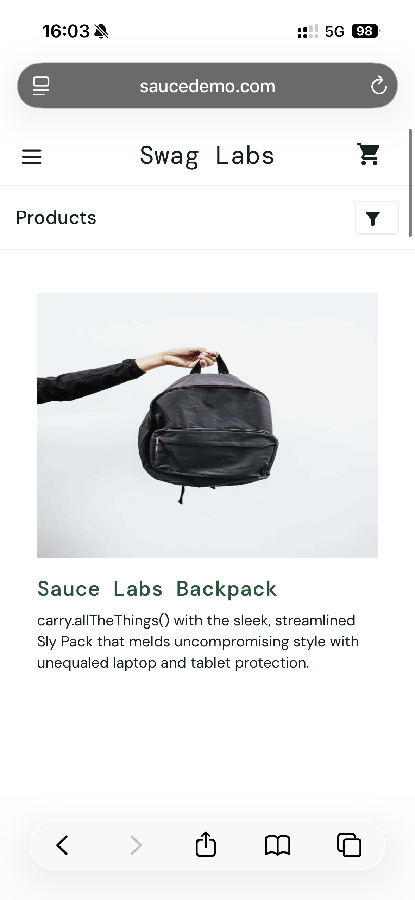
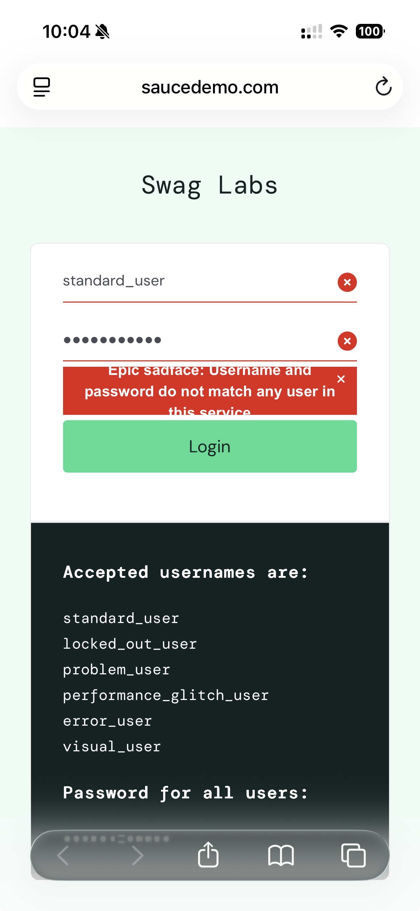

# Projeto 01 - Testes de E-commerce
## Objetivo
Testar funcionalidades de um e-commerce
## Cenários de teste
### CT-01 — Login com dados válidos

**Pré-condições:**

Usuário previamente cadastrado no sistema.

**Dados de teste:**

- Usuário: usuario.teste@email.com
- Senha: Senha@123

**Passos:**

1. Acessar a página de login.
2. Informar usuário válido.
3. Informar senha válida.
4. Clicar em "Entrar".

**Resultado esperado:**

Usuário autenticado com sucesso.

**Resultado obtido:**

Usuário foi autenticado com sucesso e direcionado para a página de produtos.

**Status:**

Passou.

**Evidência:**

### CT-02 — Login com senha inválida

**Pré-condições**

Usuário previamente cadastrado no sistema. 

**Dados de teste:**

- Usuário: usuario.teste@email.com
- Senha: Senha@321

Passos:
1. Acessar a página de login.
2. Informar usuário válido.
3. Informar senha inválida.
4. Clicar em "Entrar".

**Resultado esperado:**

O sistema deve impedir a autenticação e exibir uma mensagem informando que as credenciais são inválidas.

**Resultado obtido:**

O sistema impediu o login e exibiu a mensagem: “Epic sadface: Username and password do not match any user in this service”.

**Status:**

Passou.

**Evidência:**

